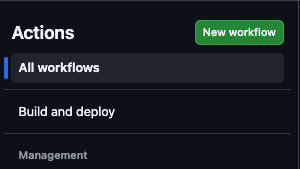

+++
title = 'GHA workflow  with workflow_dispatch trigger on your feature_branch'
description = 'How to run GHA workflow on your feature_branch with workflow_dispatch trigger'
date = '2026-04-27T12:46:20+02:00'
author = "Krzysztof Filar"
categories = ["automation", "ci/cd"]
tags = ["github", "github actions", "ci/cd", "automation"]
+++

## How to Trigger `workflow_dispatch` on a Feature Branch in GitHub Actions
If you've ever tried to manually trigger a GitHub Actions workflow from a feature branch, you may have noticed something odd: the **"Run workflow"** button simply isn't there. This happens because GitHub only allows manual triggers (`workflow_dispatch`) from the default branch.
In this guide, you'll learn a simple workaround that lets you trigger workflows from any branch using the GitHub CLI-without merging your changes prematurely.

## TL;DR
- GitHub only allows `workflow_dispatch` from the default branch
- Add a temporary `push` trigger to "register" the workflow
- Remove it after the first run
- Use `gh workflow run` with `--ref` to trigger it on your feature branch

## The Problem
Let's say you've defined a workflow that uses `workflow_dispatch` and you're developing it on a feature branch. Even though the workflow file exists in your repository, GitHub won't show the **"Run workflow”** button unless that workflow is present on the default branch.

## The Workaround
The trick is to make GitHub "see” your workflow once—after that, you can trigger it using the GitHub CLI.

### Step 1: Install GitHub CLI
If you don't already have it installed, download and install the GitHub CLI (`gh`):
https://cli.github.com/manual/installation⁠

### Step 2: Temporarily Add a push Trigger
Modify your workflow file to include a temporary push trigger for your feature branch:
```yaml
push:
  branches:
  - your_feature_branch
workflow_dispatch:
```

### Step 3: Commit and Push
Commit the change and push it to your repository. This will trigger the workflow automatically.
<br></br>
At this point, GitHub registers your workflow and makes it visible in the Actions tab.

### Step 4: Remove the Temporary Trigger
Now that the workflow has appeared in the Actions list, you can safely remove the push trigger. 

Commit and push the changes again.
<br></br>
This is a one-time setup step—without it, the CLI commands in the next step won't work.

### Step 5: Trigger the Workflow via CLI
You can now manually trigger the workflow using the GitHub CLI:
```bash
gh workflow run "Name of the Workflow" \
--ref your_feature_branch \
-f input_name="input_value" -f another_input_name="another_input_value"
```
After running this command, you should see output similar to:

```text
✓ Created workflow_dispatch event for workflow_name.yml at feature_branch_name
https://github.com/<your_repository>/actions/runs/24985074138

To see the created workflow run, try: gh run view 24985074138
To see runs for this workflow, try: gh run list --workflow="workflow_name.yml"
```

### Step 6: Verify in GitHub
Go to your repository, open the Actions tab, and you should see your workflow running.

## Final Thoughts
Go to your repository, open the Actions tab, and you should see your workflow running.
Final Thoughts
While this limitation in GitHub Actions isn't ideal, this workaround makes it possible to test workflow_dispatch workflows directly from feature branches without merging into the default branch.
<br></br>
It's a small setup cost that can significantly improve your development workflow.